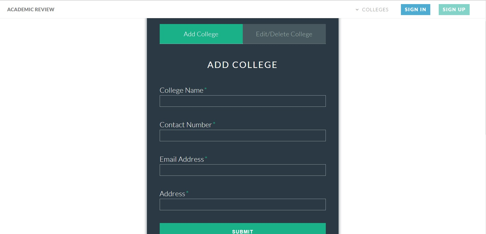
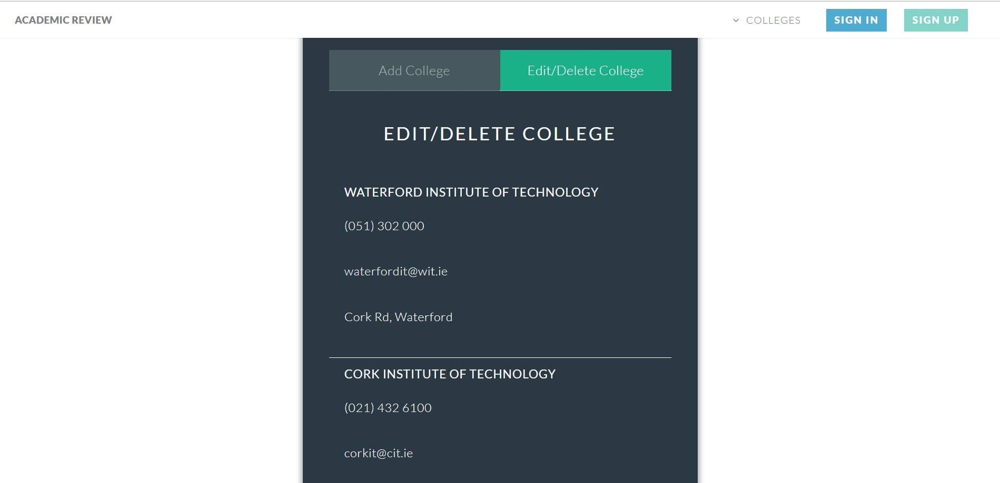
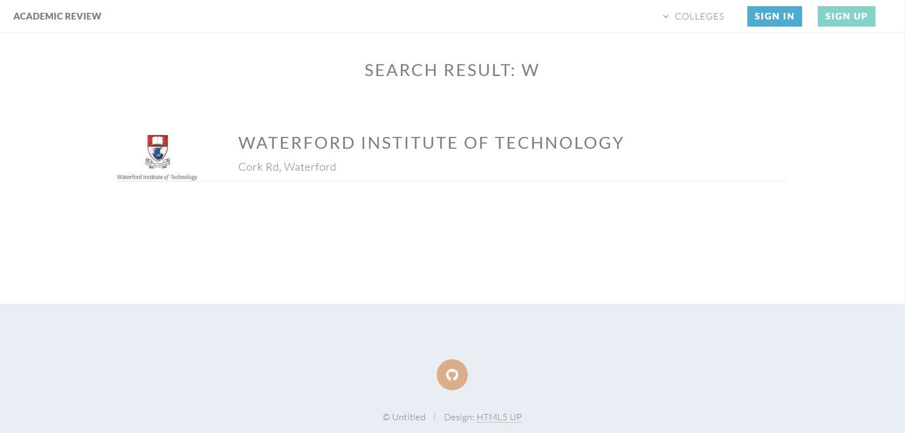
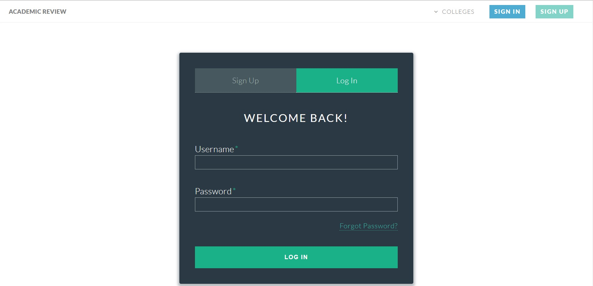
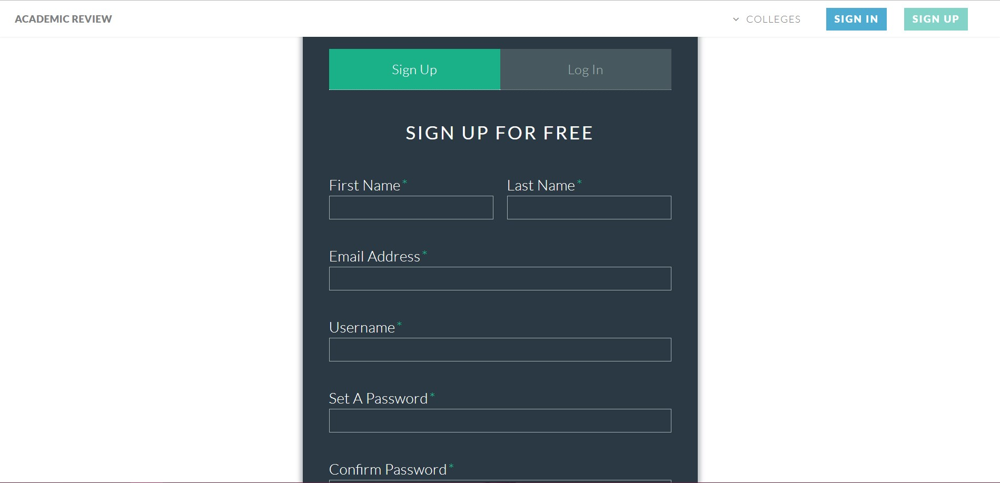

<!-- eslint-disable no-alert -->

# Academic Review Web Application
Name: Yun Shen Tan

Student Number: 20065126
## Overview
This GitHub repository contains the source code for my web application.
The web application is the project for both Web Applications Development and Agile Software Practices modules.

The web application collects universities reviews, including the reviews of courses and subjects in these universities 
from students who studied in the universities before and displays them for all members to see.

This is the frontend and backend API that will let students to add review for universities they studied. The application
is built using AngularJS, with MongoDB database and NodeJS/Express. The application is hosted on Heroku and its database
is on mLab.

## Environment
This project requires NodeJS to be installed with version that greater than 8.0.0 and I built it using Node 8.9.1, and 
NPM 5.2.0.The project are connected to the mLab database so it does not need to install database locally.

#Build Automation
Use `npm install` to install the dependencies of the project.

To build the application for development,run `npm run build:dev`. To build the application for production,
run `npm run build:prod`.The server will start after building phases are finished

To run the unit and integration test suite, run `npm test`. To run acceptance test suite, run `npm run acceptance`, it 
is not included in `npm test` because the test not running well in Travis CI.

## Automated Deployment

### Add Edit College Pages

    √ shows the main body
    √ shows the form
    √ shows the tab-group and check elements inside (85ms)
    √ shows add college input boxes and submit button (150ms)
    √ shows the header (147ms)
### Search Page

    √ shows the main body
    √ shows the header
### College Main page

    √ shows the main body
    √ shows the rating
    √ shows the college tab-group and check elements inside (78ms)
### Home page

    √ shows the main body
    √ shows the nav bar
    √ shows the buttons (69ms)
    √ shows the inner
    √ shows the elements in inner (145ms)
    √ search college (198ms)
    √ shows the footer
### All Colleges page

    √ shows the main body
    √ shows the header
### Sign In Sign Up Pages

    √ shows the main body
    √ shows the form
    √ shows the tab-group and check elements inside (69ms)
    √ shows sign up input boxes and submit button (171ms)
    √ shows the header (129ms)
    √ shows sign in input boxes and submit button (112ms)

## Continuous Integration
Travis URL: [https://travis-ci.org/rrongan/unireviewweb-full](https://travis-ci.org/rrongan/unireviewweb-full)

## Automated Deployment
Deployed Application URL in Heroku: [https://unireviewweb-full.herokuapp.com/](https://unireviewweb-full.herokuapp.com/) 

## Extra features
### CA1
+ Mocking with Mockgoose
+ Search function with Fuse.js
+ Session Control with Express session
+ Password Hashing with Bcrypt
+ Supertest integration for API endpoint testing
+ ESLint integration for code style
### CA2
+ [nyc](https://www.npmjs.com/package/nyc)for project coverage
+ [Babel Minify Webpack Plugin](https://github.com/webpack-contrib/babel-minify-webpack-plugin)for building production dist
+ 

## References

### Web Application Development Lab
+ [https://ddrohan.github.io/wit-wad/labwall.html](https://ddrohan.github.io/wit-wad/labwall.html)
### Agile Software Development Lab
+ [https://moodle.wit.ie/course/view.php?id=115160&section=5](https://moodle.wit.ie/course/view.php?id=115160&section=5)
### Mongoose password hashing
+ [https://stackoverflow.com/questions/14588032/mongoose-password-hashing](https://stackoverflow.com/questions/14588032/mongoose-password-hashing)
+ [https://www.mongodb.com/blog/post/password-authentication-with-mongoose-part-1](https://www.mongodb.com/blog/post/password-authentication-with-mongoose-part-1)
### Manage session and authentication
+ [https://codeforgeek.com/2014/09/manage-session-using-node-js-express-4/](https://codeforgeek.com/2014/09/manage-session-using-node-js-express-4/)
### Fuse.js Search
+ [http://fusejs.io/](http://fusejs.io/)
### Search check data type
+ [https://www.webbjocke.com/javascript-check-data-types/](https://www.webbjocke.com/javascript-check-data-types/)
### Supertest session
+ [https://github.com/rjz/supertest-session](https://github.com/rjz/supertest-session)
### Mockgoose Tutorial
+ [https://github.com/EnergeticPixels/testingMockgoose/blob/master/test/routes/user_test.js](https://github.com/EnergeticPixels/testingMockgoose/blob/master/test/routes/user_test.js)
+ [https://github.com/mockgoose/mockgoose](https://github.com/mockgoose/mockgoose)
### Supertest 
+ [https://github.com/visionmedia/supertest](https://github.com/visionmedia/supertest)

### Website Template
+ 